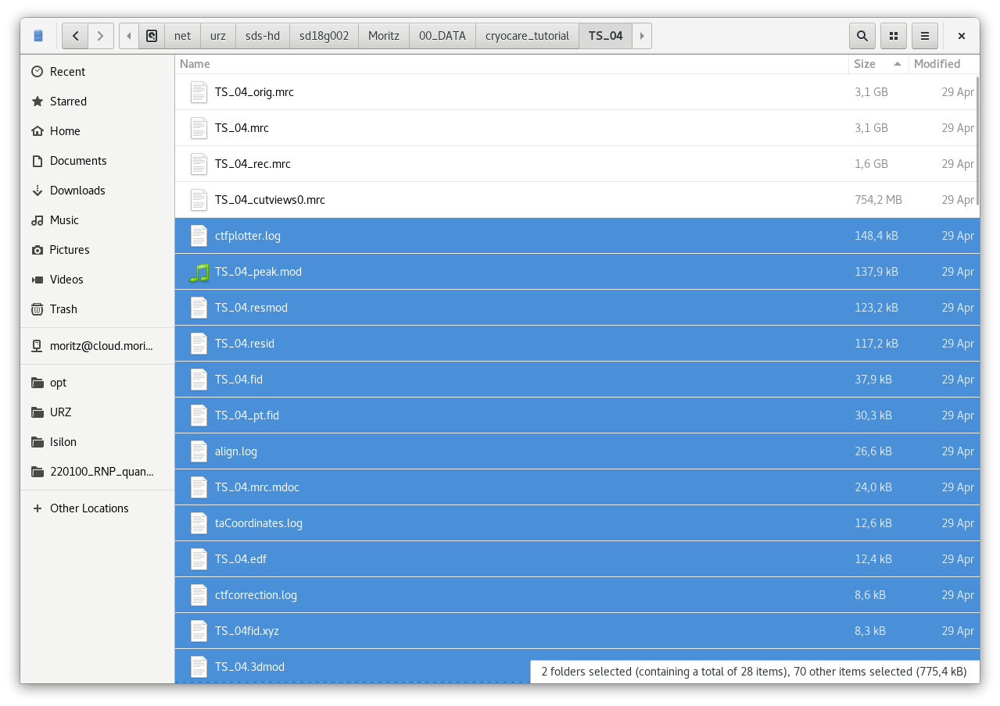
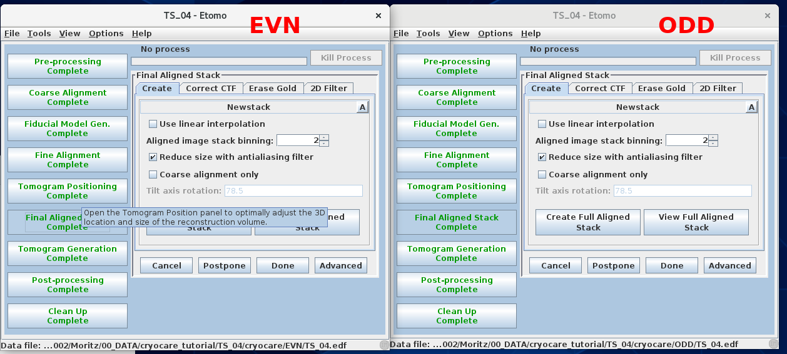

# cryoCARE denoising

A very nice tomogram denoising algorithm, the Chlanda Lab's favorite. Find out more here:

<https://github.com/juglab/cryoCARE_pip>

## 0. Prerequisites

* you have tomotools installed
* during data acquisition, you saved and even amount of movie frames
* the tilt-series frames were aligned with MotionCor2 and you saved the EVN/ODD splits
* you reconstructed the MotionCor2'ed tilt-series (not the tilt-series which is created by SerialEM)
* your reconstruction has a binning factor of 1 to 3 (pixel size somewhere in the range of 3 to 10 Å/pixel)
* in summary, you have
    * a directory (e.g. "TS_04") with your reconstruction ("TS_04/TS_04_rec.mrc")
    * two tilt-series called "TS_04_EVN.mrc" and "TS_04_ODD.mrc", each about 4GB in size

## 1. Data preparation

My example file here will be TS_04, you of course have to use your own file name.

1. create a directory for your denoising run, e.g. "TS_04/cryocare"
2. create two directories called "EVN" and "ODD" in the cryocare directory
    * in each of these, you will reconstruct one of your EVN/ODD half tilt-series
    * all the steps below are done for both halves
    * these directories are from now on called "split-reconstruction directory"
3. move your EVN/ODD half tilt-series into the respective split-reconstruction directories
4. remove the "\_EVN"/"\_ODD" part of each half tilt-series so they are both called "TS_04.mrc"
5. if you excluded some views (tilts) in your reconstruction, you will have to exclude them now manually
    * you can find out whether you excluded views by checking whether there is a file called "TS_04_cutviews0.info" in your etomo reconstruction directory
    * this file lists the slices that were excluded on the second line (it's a simple text file)
    * manually exclude the views by calling
    ```
    excludeviews -delete -views <views> TS_04.mrc
    excludeviews -delete -views 1-2,36-41 TS_04.mrc
    ```
    * first line: general syntax; bottom line: example where a number of tilts were excluded
6. copy all metadata files of your etomo reconstruction into the split-reconstruction directories
    * this is easiest done by sorting the files by size and selecting all files smaller than roughly 100 MB or so
    * don't overwrite any files!
    

## 2. Split reconstruction

1. in both split-reconstruction directories, start etomo by calling `etomo *.edf`
2. reconstruct both tilt-series in the same way starting from "Final Aligned Stack"
    * don't run CTF-Plotter, you can just click on "Correct CTF"
    * maybe etomo doesn't find the dose information file (the TS_04.mrc.mdoc), make sure the correct file is selected
    * continue to "Tomogram Generation", "Post-processing" and "Clean Up", always making sure you do everything the same way
    * you will want to enable "Convert to bytes" during post-processing
    * the tomogram needs to be thicker than 72\*2=144 slices, otherwise you need to manually specify a different patch_size below
    

## 3. Denoising

1. you now have two reconstructions, each based on separate halves of your data (they will be quite noisy, that's fine)
2. in your cryocare directory (where the EVN/ODD split-reconstruction directories are located), call the following commands:
    ```
    tomotools cryocare-extract EVN/TS_04_rec.mrc ODD/TS_04_rec.mrc
    tomotools cryocare-train
    tomotools cryocare-predict EVN/TS_04_rec.mrc ODD/TS_04_rec.mrc TS_04_denoised.mrc
    ```
    * you can check the syntax and optional parameters by calling:
    ```
    tomotools cryocare-extract --help
    tomotools cryocare-train --help
    tomotools cryocare-predict --help
    ```
    * this will run for a few hours

